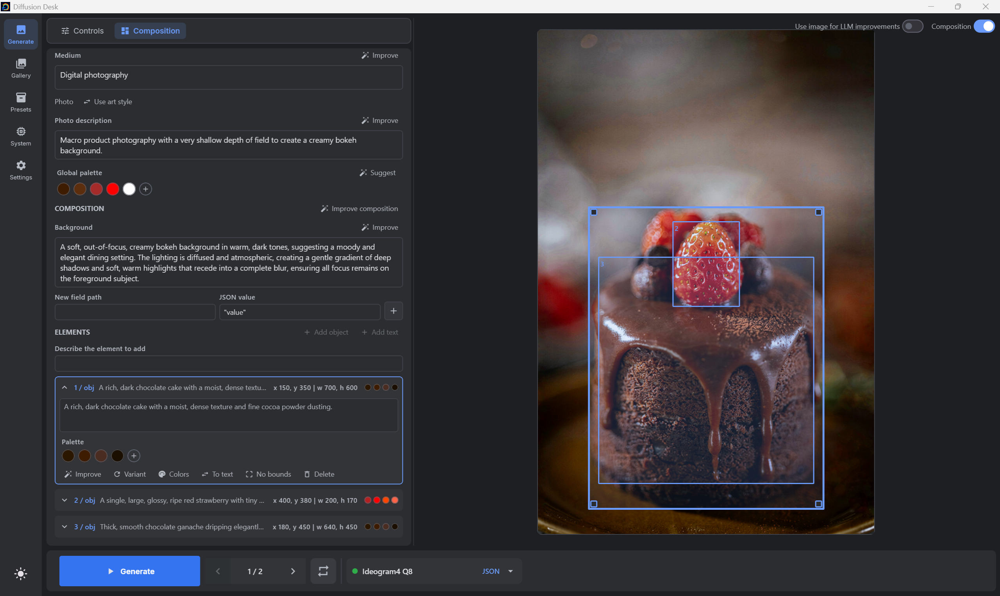

#  Diffusion Desk

Diffusion Desk is a desktop application for generating, refining, and
organizing images on your own machine. It combines native workers built around
[`stable-diffusion.cpp`](https://github.com/leejet/stable-diffusion.cpp) and
[`llama.cpp`](https://github.com/ggml-org/llama.cpp) with a Kotlin Compose
desktop interface. Image generation, prompt assistance, composition creation,
and image tagging can all run locally.



## What It Is

Diffusion Desk is designed as a practical workspace around local image models:

- **Generate** images from reusable model presets and keep working while jobs
  are queued.
- **Compose** structured Ideogram 4 prompts visually, including text, objects,
  colors, and bounding boxes on the image canvas.
- **Refine** prompts with local LLMs powered by `llama.cpp`, or generate and
  edit complete structured compositions with LLM assistance.
- **Browse** generated images in a searchable gallery, inspect their metadata,
  reuse their settings, and tag them with an optional local vision model.
- **Manage** image models, LLMs, workers, output folders, and GPU memory from the
  desktop application.

Everything runs locally. Diffusion Desk does not provide models and does not
require hosted image-generation or LLM services.

## Project Status

Diffusion Desk is under active development and is primarily validated on
Windows with an NVIDIA GPU. Linux build and packaging scripts are available for
CUDA-capable systems, but should be treated as newer than the Windows path until
they have had more machine coverage. The Compose desktop application in
`composeApp/` is the current product; the Vue application in `webui/` is
deprecated and kept only as a legacy reference.

Expect the setup and preset formats to continue evolving while the desktop
workflow is being developed.

## Getting Started

### Requirements

- Windows 10 or 11
- An NVIDIA GPU with a supported CUDA setup
- Visual Studio 2022 C++ build tools
- CMake
- CUDA Toolkit
- Java 25 JDK or JBR
- Git with submodule support

For Linux builds, use a CUDA-capable Linux distribution with NVIDIA drivers,
CUDA Toolkit, CMake, a C++17 compiler, Java 25 JDK or JBR, Git, and optionally
Ninja.

### Build From Source

Clone the repository together with its submodules:

```powershell
git clone --recursive https://github.com/Danmoreng/diffusion-desk.git
cd diffusion-desk
```

If the repository was cloned without submodules, initialize them separately:

```powershell
git submodule update --init --recursive
```

Build the native image and LLM workers:

```powershell
.\scripts\build.ps1
```

On Linux, build the native backend and workers with:

```bash
./scripts/build.sh --skip-webui
```

This builds the native workers only. It does not build or launch the Compose
desktop app.

Then start the desktop application on Windows:

```powershell
.\scripts\run-compose.ps1
```

The Windows launch script looks for Java 25 through `JAVA_HOME`, `PATH`, common
JBR installations, and Gradle-provisioned JDKs. You can also pass it explicitly:

```powershell
.\scripts\run-compose.ps1 -JavaHome "C:\Path\To\jdk-25"
```

On Linux, start the desktop application with:

```bash
./scripts/run-compose.sh
```

The Linux launcher prefers Java 25 from `JAVA_HOME`, `PATH`,
Gradle-provisioned JDKs, and common system JDK locations. You can also pass
Java explicitly:

```bash
./scripts/run-compose.sh --java-home /path/to/jdk-25
```

### First Launch

1. Open **Settings** and check the repository, model, and output directories.
2. Open **Presets** and create an image preset that points to your local model
   files and defines sensible generation defaults.
3. Open **System** to start and inspect the image worker.
4. Return to **Generate**, select the preset, enter a prompt, and start a
   generation.

Generated images are stored in the configured output directory and appear in
the Gallery. Local LLM features are optional and run through the integrated
`llama.cpp` worker. Configure an LLM preset and assign it to a role in the
System screen when you want prompt enhancement, composition generation, or
image tagging. Multimodal GGUF models can use an `mmproj` projector to inspect
the generated image or a selected composition region.

### Model Folder Structure

Diffusion Desk scans the configured model directory using the common
Automatic1111/Forge-style folder layout. Place models in these subfolders:

```text
models/
  lora/              LoRA files (.safetensors, .gguf, .ckpt, .pth)
  esrgan/            Upscaler models
  vae/               VAE files
  text-encoder/      Text encoder files
  llm/               Local LLM GGUF files
  stable-diffusion/  Stable Diffusion checkpoints
  diffusion_models/  Diffusion model components
  unet/              UNet model components
```

The Settings screen shows the resolved LoRA and upscaler folders for the
current model directory and can create missing folders for you.

## Ideogram Composition

For image presets using structured Ideogram 4 prompts, the Generate screen
offers three views of the same prompt:

- **Controls** for the regular prompt and generation parameters
- **JSON** for the complete structured prompt
- **Composition** for editing descriptions, palettes, objects, text elements,
  and their placement visually

Composition elements can be selected, moved, and resized directly on the
canvas. Changes support undo and redo, and the planned composition can be shown
over the generated image. Optional local LLM actions can improve individual
fields or generate a complete composition without sending the prompt or image
to a remote service.

## Local LLM Workflows

The integrated `llama.cpp` worker is more than a general prompt helper. It is
used in three parts of the application:

- **Prompt enhancement** expands or rewrites regular image prompts before
  generation.
- **Composition generation** creates structured Ideogram 4 prompts and can
  refine individual descriptions, elements, or color palettes.
- **Image tagging** analyzes gallery images with a local multimodal model and
  stores searchable tags alongside their metadata.

LLM presets and roles are managed independently from image-model presets, so
different local models can be used for prompting, assistance, and tagging.

## Portable Windows Build

Create a portable application folder and ZIP archive with:

```powershell
.\gradlew.bat packageWindows
```

The archive is written to:

```text
composeApp\build\compose\binaries\main\portable\diffusion-desk-windows-portable.zip
```

To reuse an existing native build:

```powershell
pwsh -ExecutionPolicy Bypass -File .\scripts\package-windows.ps1 -SkipNativeBuild
```

Packaging requires a Java 25 JDK or JBR that includes `jpackage`.

## Portable Linux Build

Create a portable Linux application folder and tarball with:

```bash
./gradlew packageLinux
```

The archive is written to:

```text
composeApp/build/compose/binaries/main/portable/diffusion-desk-linux-portable.tar.gz
```

To reuse an existing native build:

```bash
./scripts/package-linux.sh --skip-native-build
```

To also produce a `.deb` package, run:

```bash
./gradlew packageLinuxDeb
```

Linux portable packaging uses the Compose Java toolchain. Debian packaging
additionally requires a Java 25 JDK or JBR with `jpackage` and the Linux
packaging tools available on the host system.

## Repository Guide

- `composeApp/`: current Kotlin Compose desktop application
- `src/`: native backend and SD/LLM workers
- `scripts/`: build, run, packaging, and verification scripts
- `docs/`: architecture notes, implementation plans, and legacy documentation
- `webui/`: deprecated Vue frontend
- `libs/`: submodules and vendored upstream dependencies

See [ARCHITECTURE.md](ARCHITECTURE.md) for the system design and
[docs/LEGACY_WEBUI_README.md](docs/LEGACY_WEBUI_README.md) for the archived web
interface.

## Development

Run the Compose application directly with Gradle:

```powershell
.\gradlew.bat :composeApp:run
```

On Linux:

```bash
./gradlew :composeApp:run
```

Use the hot-reload helper while working on the desktop UI:

```powershell
.\scripts\run-compose-hot-reload.ps1
```

Run the Compose desktop tests with:

```powershell
.\gradlew.bat :composeApp:desktopTest
```

On Linux:

```bash
./gradlew :composeApp:desktopTest
```

For native changes, use `.\scripts\build.ps1` so the repository's Windows
build configuration and patches are applied consistently.

## Acknowledgements

Diffusion Desk builds on two excellent local inference projects:

- [`stable-diffusion.cpp`](https://github.com/leejet/stable-diffusion.cpp) for
  native image generation
- [`llama.cpp`](https://github.com/ggml-org/llama.cpp) for local text and
  multimodal LLM inference

## License

Diffusion Desk is released under the [MIT License](LICENSE).
