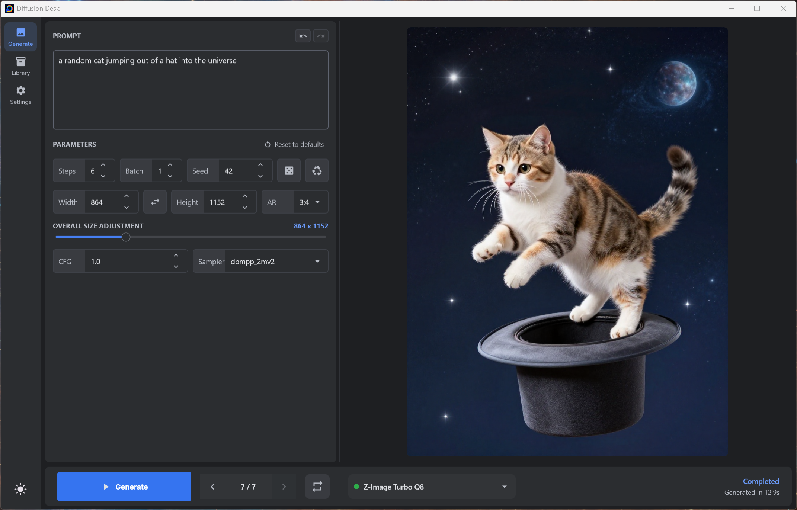
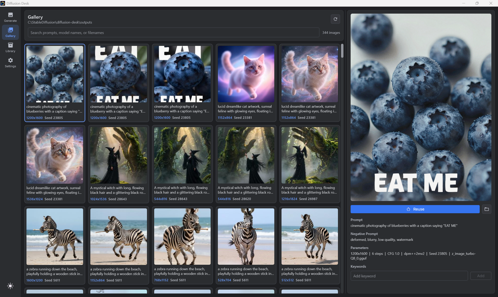
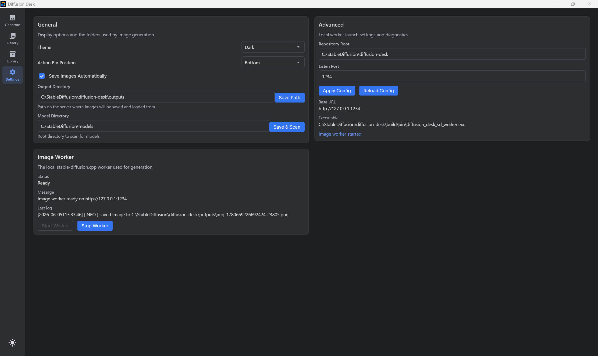

# Diffusion Desk

Diffusion Desk is a minimal local desktop app for generating images with
`stable-diffusion.cpp`. The current app is built with Kotlin Compose
Multiplatform and focuses on a direct, quiet workflow: choose a model preset,
write a prompt, generate, inspect the image, and keep moving.

The older Vue/orchestrator README is archived here:
[docs/LEGACY_WEBUI_README.md](docs/LEGACY_WEBUI_README.md).

## Current Compose App

The current user-facing app is `composeApp/`. It starts the native SD worker
locally and talks to it over HTTP on `127.0.0.1`.

Main screens:

- **Generate:** prompt editor, negative prompt, compact generation controls,
  prompt history, image queue/history navigation, live progress stages, ETA,
  and generated image preview.
- **Gallery:** SQLite-backed browser for generated images, with prompt and
  metadata import, manual keywords, searchable image history, reusable
  generation parameters, and thumbnail previews for smooth scrolling.
- **Library:** JSON-backed image preset editor for model components and default
  generation parameters.
- **Settings:** theme, action bar placement, model/output paths, worker status,
  and advanced launch diagnostics.

Generated images support a desktop context menu for copy, save, open, and show
in Explorer.

## Screenshots

Generate view:



Gallery view:



Settings view:



## Gallery

The Gallery screen indexes the configured output directory into a local SQLite
database stored in the Diffusion Desk app data directory. It reads current `.txt`
sidecar metadata and embedded PNG metadata, then exposes the prompt, negative
prompt, dimensions, seed, sampler, model id, and user-managed keywords.

Selecting **Reuse** imports the image parameters back into Generate so an older
image can be used as the starting point for a new run. Existing orchestrator
thumbnail mappings are reused when available, and missing thumbnails are created
under `outputs/previews/` to keep browsing and scrolling responsive.

## Preset-Driven Generation

Image models are loaded through presets. The preset dropdown lives in the
Generate action bar and loads a preset as soon as it is selected.

The status dot next to the preset name means:

- Green: selected preset is loaded
- Orange: preset is loading
- Red: preset load failed

A preset can define:

- Diffusion model
- VAE
- CLIP-L / CLIP-G
- T5XXL encoder
- LLM text encoder, for architectures such as Z-Image
- CPU placement flags
- Flash attention flag
- Default width, height, steps, CFG, sampler, and negative prompt

Presets are stored as JSON files in the app data directory under
`image-presets/`.

## Runtime Layout

The Compose app expects the native worker and DLLs to exist in the repository or
portable app root:

- SD worker: `build/bin/diffusion_desk_sd_worker.exe`
- LLM worker: `build/bin/diffusion_desk_llm_worker.exe`
- Models: `models/`
- Generated images: `outputs/`

Recommended model layout:

- `models/stable-diffusion/`
- `models/vae/`
- `models/text-encoder/`
- `models/llm/`
- `models/lora/`

## Requirements

Windows is the primary supported development and packaging target right now.

- Windows 10/11
- Visual Studio 2022 C++ build tools
- CMake
- CUDA Toolkit, because the native build scripts currently enable CUDA by default
- Java 25 JDK/JBR for Compose desktop
- Java 25 JDK/JBR with `jpackage` for packaging

The run and packaging scripts can use Gradle-provisioned JDKs from `.gradle\jdks`
if `JAVA_HOME` is not set.

## Build

Clone with submodules:

```powershell
git clone --recursive https://github.com/Danmoreng/diffusion-desk.git
cd diffusion-desk
```

If submodules are missing:

```powershell
git submodule update --init --recursive
```

Build the native backend and worker:

```powershell
.\scripts\build.ps1
```

For the Compose app, the important native output is
`build\bin\diffusion_desk_sd_worker.exe` plus its DLL dependencies.

## Run

Use the helper script:

```powershell
.\scripts\run-compose.ps1
```

Or run Gradle directly:

```powershell
.\gradlew.bat :composeApp:run
```

For hot reload during Compose UI development:

```powershell
.\scripts\run-compose-hot-reload.ps1
```

## Package On Windows

Create a portable Windows app image and zip:

```powershell
.\gradlew.bat packageWindows
```

Or run the packaging script directly:

```powershell
pwsh -ExecutionPolicy Bypass -File .\scripts\package-windows.ps1
```

Outputs:

- App folder: `composeApp\build\compose\binaries\main\app\diffusion-desk`
- Portable zip:
  `composeApp\build\compose\binaries\main\portable\diffusion-desk-windows-portable.zip`

If `build\bin` already contains a fresh native worker build:

```powershell
pwsh -ExecutionPolicy Bypass -File .\scripts\package-windows.ps1 -SkipNativeBuild
```

To also ask Compose/jpackage for an MSI:

```powershell
.\gradlew.bat packageWindowsMsi
```

## Repository Map

- `composeApp/`: current Kotlin Compose desktop app
- `src/workers/`: native SD and LLM worker entry points
- `src/sd/`: SD worker API, generation jobs, progress, and server state
- `src/orchestrator/`: older orchestrator/database/web stack
- `webui/`: older Vue web UI
- `scripts/`: build, run, packaging, and verification scripts
- `libs/`: vendored/submodule dependencies

## Legacy Web UI

The older browser app and orchestrator still exist in this repository. They are
not the main path on this branch, but they can still be built and run with:

```powershell
.\scripts\build.ps1
.\scripts\run.ps1
```

That path serves the Vue web UI at `http://localhost:1234/app/`. See the
archived README for the old architecture and feature description:
[docs/LEGACY_WEBUI_README.md](docs/LEGACY_WEBUI_README.md).

## Development Notes

- Validate Compose desktop changes with
  `.\gradlew.bat :composeApp:compileKotlinDesktop`.
- Validate native/backend changes with `.\scripts\build.ps1`.
- Do not edit `libs/` unless you intentionally need to change vendored upstream
  code.
- Treat `config.json`, logs, databases, models, outputs, and build products as
  local runtime artifacts.

## License

Diffusion Desk is released under the [MIT License](LICENSE).
